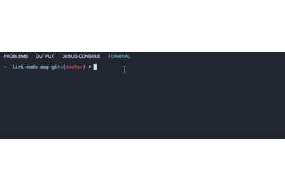

# Liri-Node-App

LIRI is a _Language_ Interpretation and Recognition Interface. LIRI is a command line node app that takes in parameters and gives you back data.

## Screen Shots

## Technologies used
- Node.js
- twitter NPM Package - https://www.npmjs.com/package/twitter
- tumblr NPM Package - https://www.npmjs.com/package/tumblr
- spotify NPM Package - https://www.npmjs.com/package/node-spotify-api
- request NPM Package - https://www.npmjs.com/package/request

## Built With

* Visual Studio Code - Text Editor

## Authors

* **Sandy Yeung** - *HTML/JS/Node.js* - [Sandy Yeung](https://github.com/Sandynism)